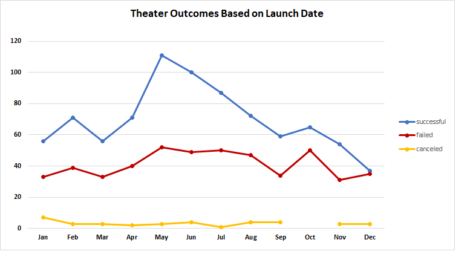

# An Analysis of Kickstarter Campaigns

## Using Kickstarter data to uncover trends 

### The purpose of this project is to use Kickstarter data to understand how different fundraising campaigns fared in relation to their launch dates and funding goals. This will help Louise understand how her campaign fared in relation to others with similar characteristics. It may also help identify if any adjustments should be made to future theatre fundraising strategies.  

## Analysis and Challenges

### Analysis of Outcomes Based on Launch Date
### 
To determine trends of outcomes based on launch date the Kickstarter data was aggregated into the 12 months of the year and filtered to only represent “theatre” campaigns. This helped ensure other categories that may have different seasonality than theatre are not skewing the trend that is being analyzed. In counting the number of successful, failed, and canceled theatre campaigns per month we see a large jump in the number of successful campaigns that are launched in May while the number of failed campaigns has a much smaller increase. In the following summer months we see the ratio of successful/failed campaigns remain higher than the rest of the year, albeit with a downward trend. In December we see the ratio of successful to failed campaigns become almost 1:1 for the only time of the year. The number of canceled campaigns does not significantly change throughout the year. 
### Analysis of Outcomes Based on Goals
### 
This analysis looked at whether there was a trend between the initial kickstarter fundraising goal and the outcome of the campaign. The data analyzed was filtered to just include “plays” as funding necessary for other projects or types of theatre can vary widely. We initially see plays with lower fundraising goals having a higher chance of success than those with larger targets. The likelihood of failure becomes more probable than that of success at the “$15000-$19999” range and continues the trend until the $30,000 target. After this point the % likelihood of success/failure begins to vary widely based on $5000 differences in funding. There is no discernible trend from the $30000 target & beyond. 
### Challenges and Difficulties Encountered
In the outcomes based on launch date analysis the % successful/failed/canceled would have been a better statistic for Louise than total number of successes/failures. Just knowing that more campaigns were launched in a certain month does not necessarily help Louise determine how her campaign fared in relation to others, as an increase in number of successes could also mean an increase in number of failures. Although the trend lines help Louise see that May had the highest % of success, it would’ve  been easier for her to determine the actual probability with a y axis based on the ratio of success/failure.

In the outcomes based on goal analysis the number of campaigns the total number of projects analyzed for each category varied widely, with some of the higher dollar fundraising goals only having a few examples. This lack of data within certain dollar figures meant a success/failure of a campaign within the 35000-39999 range had much more weight than the success/failure of a campaign within the 1000-4999 range. This lack of data likely caused inconsistent trends within the higher dollar goals. The graph does not clearly indicate this difference in data and leads the consumer to believe each range had a stastically significant amount of data to back it.

## Results
### Conclusions of Outcomes Based on Launch Date
Based on the data we can conclude that people are more likely to donate to a theatre fundraiser in the summer than around the holidays and that May is the best month to launch a theatre kickstarter campaign.

### Conclusion of Outcomes Based on Goals
Based on the data we can conclude that as fundraising goals approach$15,000 target the chances of a successful outcome become lower.

### Limitations
There is a lack of plays setting fundraising goals beyond $15,000. This makes it hard to determine whether the trend of campaigns becoming less successful as they raise goals continues beyond that mark. 

The dataset used also only looks at whether a campaign was a success or failure. It does not take into account that a campaign may of barely missed or made the mark. In Louise’s case her campaign would be considered a failure, even though she was close to her goal. Understanding this data would help Louise determine if there were certain goal amounts or months in which campaigns were way off their fundraising mark and thus even less likely to be successful

### Additional graphs to better understand trends

A graph that shows average donation size and likelihood of success/failure. This would help visualize if successful campaigns tended to have large donations that pushed them over their goal or a lot of smaller contributions.

A line chart with months on the x axis, % over or under goal on the Y axis, and 2 lines- one for success and one for failures. This would help determine whether certain months tended to have campaigns that succeeded/failed by a significant margin and help Louise determine how to be more risk averse in the future. 
